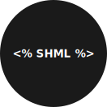

<p align="center">

</p>

<br />

<div align="center">
<h3>ShellScript Hypertext Markup Language</h3>
<h4>Generates dynamic HTML content via ShellScript.</h4>
</div>

<br /><br />

## **INSTALL**

Requirements: **Web Server (Apache2 | Nginx) and FCGI Wrap**

### _LINUX_ (Debian)

**FCGI Wrap**

_debian@debian:~$_ **su**

_root@debian:~#_ **apt install fcgiwrap**

**Apache2 Modules**

_debian@debian:~$_ **su -**

_root@debian:~#_ **a2enmod proxy_fcgi**

_root@debian:~#_ **/etc/init.d/apache2 restart**

---

**SHML**

_root@debian:~#_ **sh install.sh**

- Your shell functions must be declared or included in the file: **/usr/share/shml/library.sh**

- Place the index.shml file in the public directory of the web server.

---

**index.shml**

```html
<!DOCTYPE html>
<html>
<head>
<title>SHML <% version() %></title>
</head>
<body>
<!--

Block comment...

-->
<h1>It worked! <% print("Welcome!") %></h1>
<!-- Inline comment -->
<hr>
<h2><% hello_world() %></h2>
<h3><% date(%Y-%m-%d) %></h3>
</body>
</html>
```

Result:

---

```html
<!DOCTYPE html>
<html>
<head>
<title>SHML 1.0.0</title>
</head>
<body>
<h1>It worked! Welcome!</h1>
<hr>
<h2>Hello World!</h2>
<h3>2022-10-20</h3>
</body>
</html>
```
